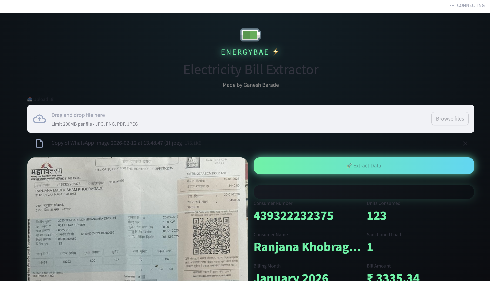

# ⚡ ENERGYBAE — Electricity Bill Extractor

A modern AI-powered web app to extract key details from electricity bills and automatically generate a structured Excel report.

---
## 📸 Screenshots

### 🖥️ Main UI



---

## 🚀 Features

* 📤 Upload electricity bill (JPG / PNG / PDF)
* 🔍 OCR-based data extraction using **Tesseract**
* 🎯 Accurate **Consumer Number detection (custom logic)**
* 📊 Extracts:

  * Consumer Number
  * Consumer Name
  * Billing Month
  * Units Consumed
  * Sanctioned Load
  * Tariff Category
  * Bill Amount
* 📥 Auto-fills Excel template
* 💎 Clean dark UI with glow effects (Streamlit)

---

## 🧠 Tech Stack

* **Frontend/UI:** Streamlit
* **OCR Engine:** Tesseract
* **Image Processing:** PIL (Pillow)
* **PDF Handling:** pdf2image
* **Excel Automation:** openpyxl
* **Regex Processing:** Python `re`

---

## 📁 Project Structure

```
energybae-solar/
│
├── app.py                        # Main Streamlit app
├── extract_consumer_number.py   # Custom consumer number logic
├── solar_template.xlsx          # Excel template
├── sample_bill.jpeg             # Sample input
├── requirements.txt             # Dependencies
└── README.md
```

---

## ⚙️ Installation

### 1️⃣ Clone the repository

```bash
git clone https://github.com/your-username/energybae-solar.git
cd energybae-solar
```

---

### 2️⃣ Install dependencies

```bash
pip install -r requirements.txt
```

---

### 3️⃣ Install Tesseract

#### macOS (Homebrew)

```bash
brew install tesseract
```

#### Ubuntu

```bash
sudo apt install tesseract-ocr
```

#### Windows

Download from: https://github.com/tesseract-ocr/tesseract

---

### 4️⃣ Run the app

```bash
streamlit run app.py
```

---

## 📸 How It Works

1. Upload your electricity bill
2. App processes image using OCR
3. Extracts structured data
4. Displays results in UI
5. Generates downloadable Excel file

---

## 🎯 Consumer Number Logic

Custom regex-based extraction ensures high accuracy:

* Supports Hindi label (`ग्राहक क्रमांक`)
* Filters out invalid numbers (like dates)
* Detects standalone 12-digit IDs

---

## 📊 Output

* Clean UI display of extracted data
* Downloadable Excel file with mapped fields

---

## 🔥 Future Improvements

* Smart region detection (auto crop sections)
* Multi-bill batch processing
* Cloud deployment (AWS / GCP)
* AI-based table extraction
* Mobile-friendly UI

---

## 👨‍💻 Author

**Ganesh Barade**
Built with ⚡ under ENERGYBAE

---

## 📄 License

This project is open-source and available under the MIT License.

---
